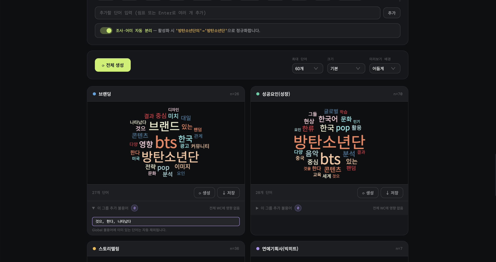

# ⌨️ WordLens Stopword Typing

> 워드클라우드 생성 시, 원하지 않는 단어(불용어)는 **타이핑으로 직접 등록**해 다시 분석할 수 있는 도구입니다.

텍스트(예: 보고서, 인터뷰, 기사)에서 자주 나온 단어를 워드클라우드로 보여주고,  
최종 결과는 **PNG 이미지**로 저장할 수 있으며, 필요하면 **단어 빈도표**도 함께 붙여서 내보낼 수 있습니다.  
또한 CSV에 카테고리 컬럼이 있으면 **그룹별 워드클라우드**도 한 번에 만들 수 있습니다.

🔗 **Live Demo**: [gleeful-cactus-4d3e40.netlify.app/](gleeful-cactus-4d3e40.netlify.app/)

---

## 이 서비스가 하는 일

- 텍스트 파일/CSV를 불러와 자주 등장한 단어를 시각화합니다.
- 화면에서 불용어를 직접 입력해 제외 목록을 만듭니다.
- 다시 생성하면 등록한 불용어가 빠진 워드클라우드가 만들어집니다.
- CSV의 특정 컬럼(예: 카테고리/부서/브랜드)을 기준으로 그룹별 워드클라우드를 생성합니다.
- 불용어를 **공통(전체 적용)** 또는 **특정 그룹 전용**으로 나눠 관리할 수 있습니다.
- 워드클라우드 단독 또는 워드클라우드+빈도표 형태로 PNG 저장이 가능합니다.

## 예시 1) 전체 분석

예를 들어 BTS 관련 기사 500건을 분석했는데, `그리고`, `하지만`, `관련` 같은 단어가 너무 많이 보인다고 가정해보겠습니다.

1. 워드클라우드를 한 번 생성해 전체 흐름을 봅니다.
2. 불용어 입력칸에 `그리고 하지만 관련`을 입력(Enter 또는 쉼표로 여러 개 등록)합니다.
3. 다시 생성하면 핵심 키워드(예: `팬덤`, `콘텐츠`, `전략`)가 더 선명하게 보입니다.
4. 결과를 `워드클라우드 + 빈도표` PNG로 저장해 보고서/슬라이드에 바로 사용합니다.

## 예시 2) 그룹별 분석

CSV에 `카테고리` 컬럼이 있고 값이 `브랜딩 / 성공요인 / 스토리텔링`이라고 가정해보겠습니다.

1. 그룹 기준을 `카테고리`로 선택하면 카테고리별 워드클라우드가 각각 생성됩니다.
2. `공통 불용어`에 `그리고`, `하지만`을 넣으면 모든 그룹에서 동시에 제거됩니다.
3. `브랜딩` 그룹에서만 많이 보이는 군더더기 단어가 있으면, 그 단어는 `브랜딩 그룹 전용 불용어`로만 제거할 수 있습니다.
4. 그래서 다른 그룹(예: 성공요인, 스토리텔링) 결과는 유지하고, 필요한 그룹만 정밀하게 다듬을 수 있습니다.

## 핵심 가치

- 빠른 반복: 불용어 추가 → 재생성 과정을 짧게 반복 가능
- 정밀 제어: 공통/그룹별 불용어를 분리해 더 정확한 비교 가능
- 쉬운 공유: 결과를 PNG로 바로 저장
- 설명력 강화: 시각화(워드클라우드)와 수치(빈도표)를 함께 제공
